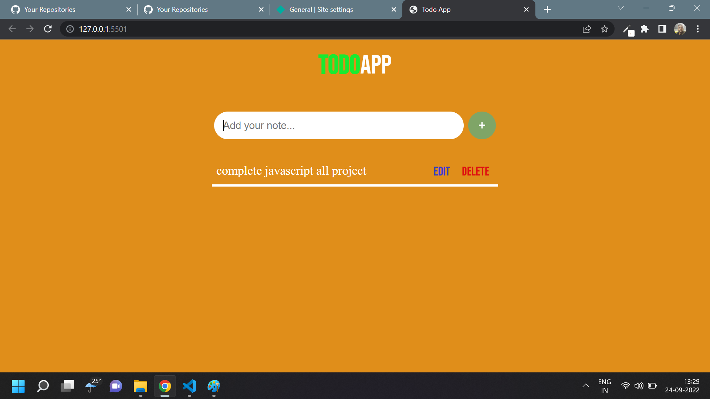

# Javascript TODO APP

## TODO App [Live Link](https://todo-appp-js.netlify.app/)

- Skills Gained in this project

  - create to do markup by insert adjacenthtmlelement

  - edit todos using using index pass into the markup

  - delete todo using filter method

---

## Time taken to finish this project

- 1 hour 50 minutes to complete it

#### Screenshot

